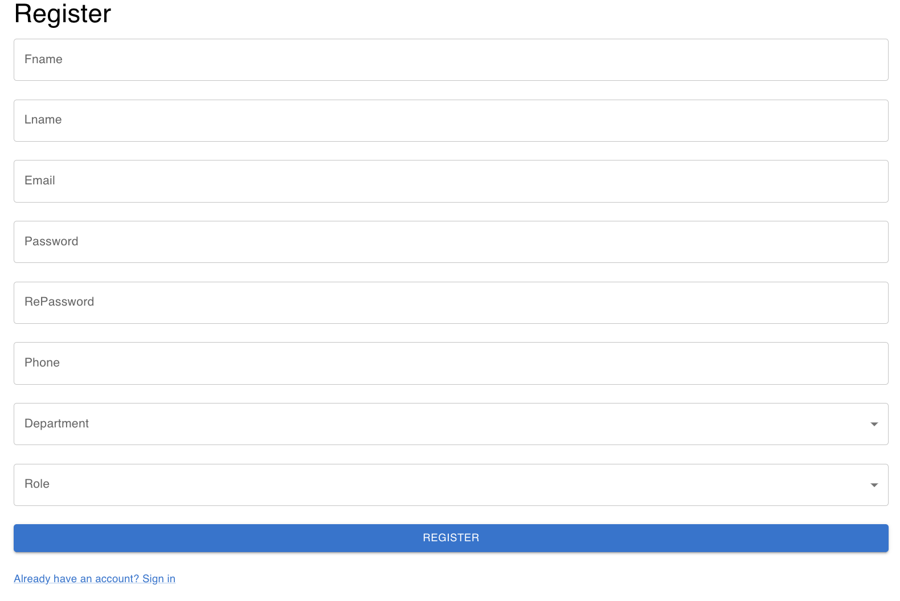
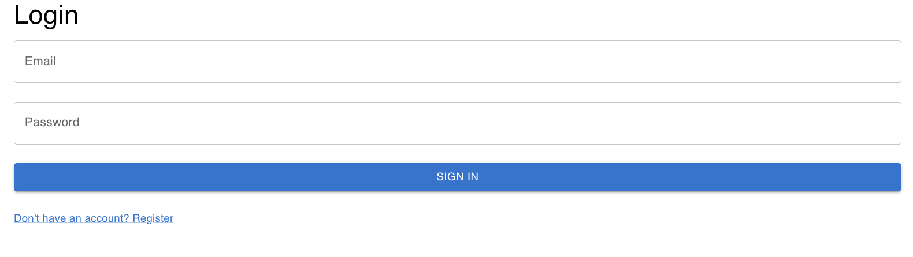
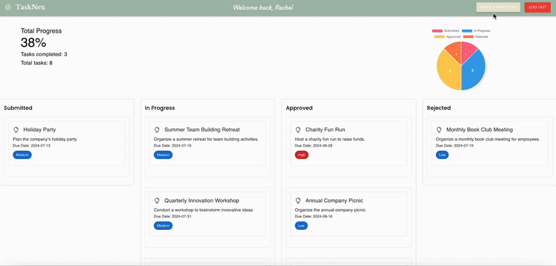

# TaskNex


## Overview

TaskNex is a comprehensive web application designed to allow users to submit and manage tasks all in one place. Inspired by the challenges faced by companies with administrators operating across different time zones, TaskNex streamlines task management through a clear dashboard, preventing tasks from being overlooked and enhancing efficiency.

## Features

- **Centralized Task Management**: Submit, track, and manage tasks from a single dashboard.
- **User Roles & Permissions**: Differentiate access and control based on user roles.
- **Real-time Updates**: Immediate reflection of task changes and updates.
- **Visual Analytics**: Utilize charts and graphs to monitor task statuses and progress.
- **Server Monitoring**: Ensure server reliability with PM2, automatically restarting in case of crashes.


## Technologies Used


- Front End: React, Material-UI, react-chartjs-2
- Back End: Node.js, Express.js
- Database: MongoDB
- Process Management: PM2


## Installation

1. Clone the Repository

```sh
git clone https://github.com/yeji2060/TaskNex.git
cd TaskNex
```


2. Install Client Dependencies
```sh
cd client
npm install
```

3. Install Server Dependencies
```sh
cd ../server
npm install
```

4. Set Up Environment Variables (Create .env file in server directory)
```sh
echo "MONGO_URI=your_mongodb_connection_string" >> .env
echo "PORT=5000" >> .env
```

5. Start Server with PM2 
(Ensure PM2 is installed globally: npm install -g pm2)
```sh 
pm2 start server.js --name TaskNex-Server
```

6. Start Client
```sh
cd ../client
npm start
```


## Usage

<br><br>
- **User Registration and Login**: Create an account or log in to start managing tasks.

<br><br>

<br><br>



&&& After you login, you will see the dashboard with the all the tasks that the user have access.


- **Task Submission**: Easily submit new tasks with detailed descriptions, due dates, and priorities.




- **Dashboard Overview**: View all tasks in a centralized dashboard with status updates and visual charts.


- **Admin Controls**: Administrators can oversee tasks across different time zones, update statuses, and ensure tasks are not overlooked.


## Future enhancement 


## Contributing

This project was developed by a team to address specific task management challenges. Contributions are welcome! Please feel free to submit issues or pull requests for improvements and new features.


