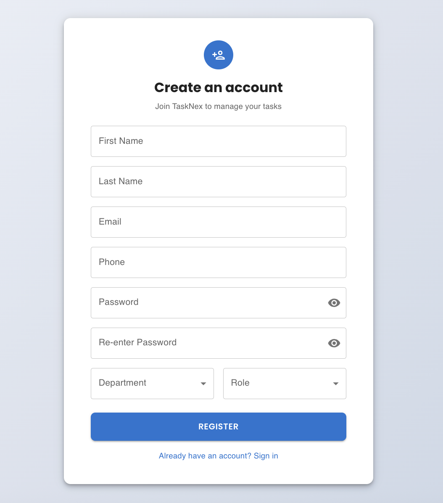
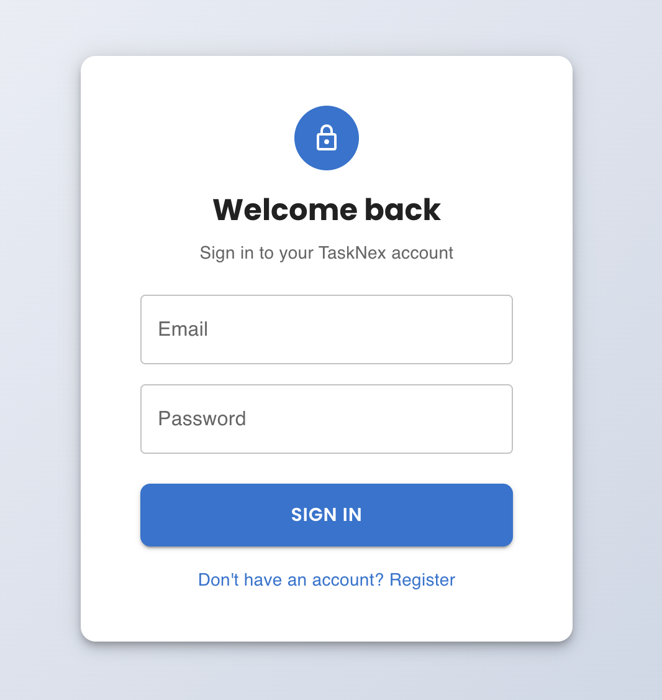
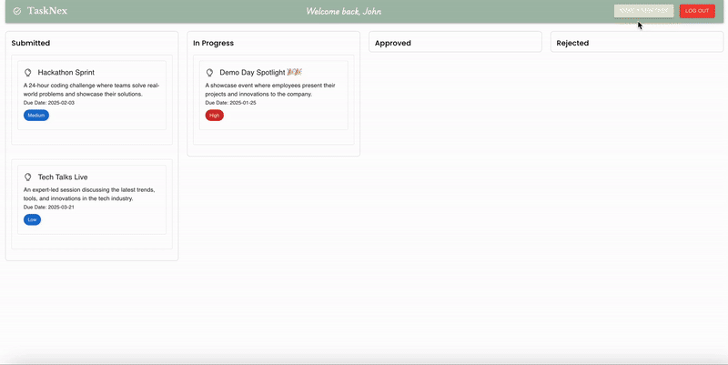
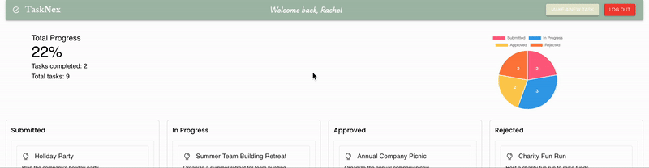
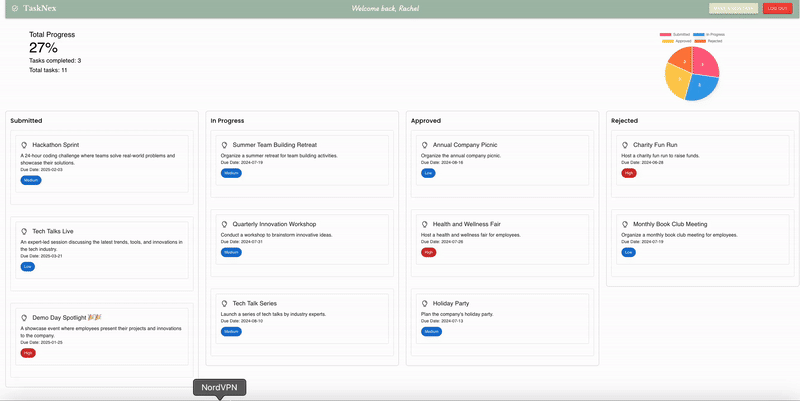
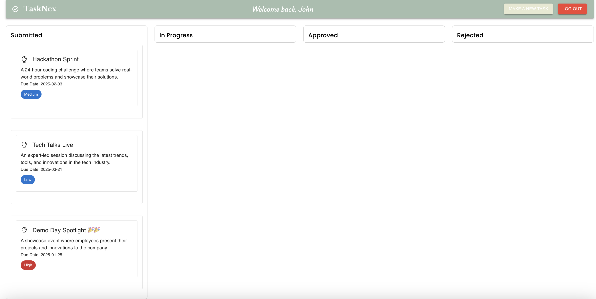
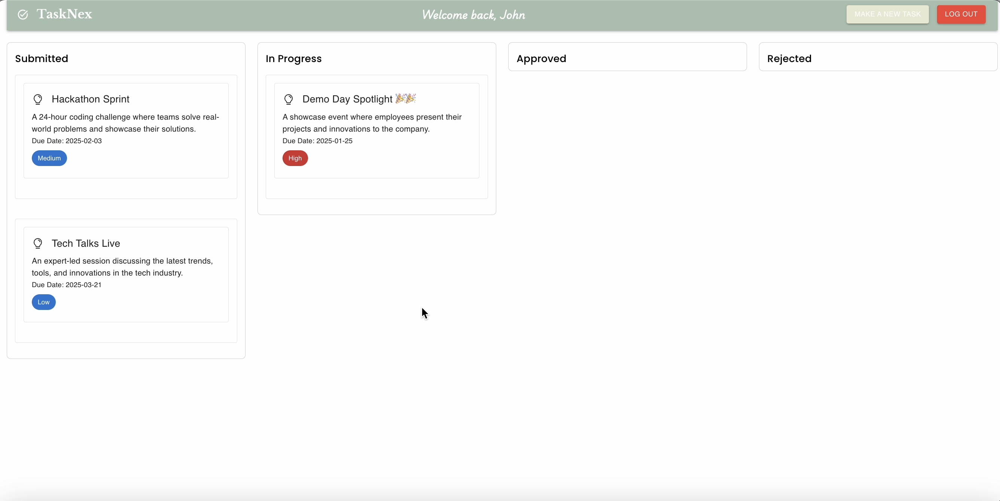

# TaskNex


## Overview

TaskNex is a comprehensive web application designed to allow users to submit and manage tasks all in one place. Inspired by the challenges faced by companies with administrators operating across different time zones, TaskNex streamlines task management through a clear dashboard, preventing tasks from being overlooked and enhancing efficiency.

## Features

- **Centralized Task Management**: Submit, track, and manage tasks from a single dashboard.
- **User Roles & Permissions**: Differentiate access and control based on user roles.
- **Real-time Updates**: Immediate reflection of task changes and updates.
- **Visual Analytics**: Utilize charts and graphs to monitor task statuses and progress.
- **Server Monitoring**: Ensure server reliability with PM2, automatically restarting in case of crashes.


## Technologies Used


- Front End: React, Material-UI, react-chartjs-2
- Back End: Node.js, Express.js
- Database: MongoDB
- Process Management: PM2


## Installation

1. Clone the Repository

```sh
git clone https://github.com/yeji2060/TaskNex.git
cd TaskNex
```


2. Set Up the Backend

- Navigate to the backend directory:

```sh
cd Backend
```
- Install dependencies and start the server:
```sh
npm install
npm start
```


3. Set Up the Frontend 

- Open a new terminal window, navigate to the frontend directory: 

```sh
cd TaskNex_server
```

- Install dependencies and start the frontend server:
```sh
npm install
npm start
```


## Usage


- **User Registration and Login**: Create an account or log in to start managing tasks. 

During registration, users can select their department (e.g., HR, Accounts, etc.) and specify their role as either an admin or a user.

Admins have advanced privileges for managing and overseeing tasks, while users can create and track their own tasks.


<br><br>

<br><br>

Once registered, users can log in to access their personalized dashboard and start managing tasks efficiently.




**< User side >**

- **Task Submission**: Easily submit new tasks with detailed descriptions, due dates, and priorities.





**< Admin side >**

After logging in as an admin, you will have access to a dashboard displaying all tasks created by users in your team (e.g., HR, Accounts, etc.).


- **Dashboard Overview**: View all tasks in a centralized dashboard with status updates and visual charts.




- **Admin Controls**: Administrators can manage tasks across different time zones, update statuses, and ensure tasks are completed without being overlooked.




- Changes made by admins are updated in real time on the user's side.

Before the admin updates the status:



Right after the admin updates the status:



## Future enhancement 

- **Task Notifications**:
Add real-time email or in-app notifications to alert users and admins about task updates, deadlines, or status changes.
- **Advanced Task Filters and Search**:
Introduce robust filters and search functionality to help users quickly locate tasks based on keywords, due dates, or priority levels.
- **Customizable Dashboards**:
Allow users and admins to customize their dashboard views with widgets like task summaries, charts, or progress trackers.
- **Integration with Third-Party Tools**:
Enable integrations with popular tools like Slack, Microsoft Teams, or Google Calendar for better task management and collaboration.


## Contributing

This project was developed by our team to address specific task management challenges. Contributions are welcome! Please feel free to submit issues or pull requests for improvements and new features.


