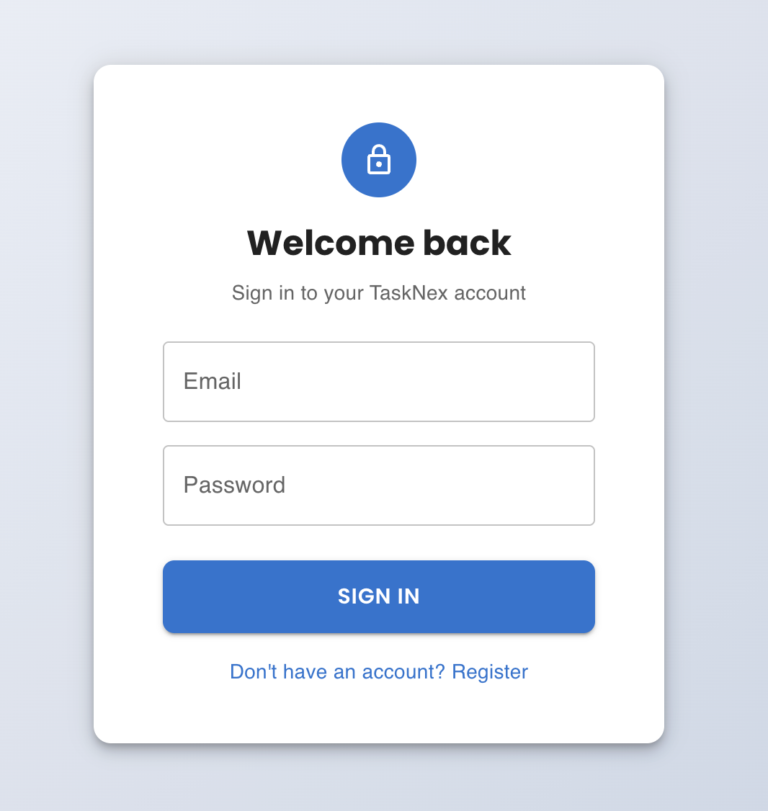
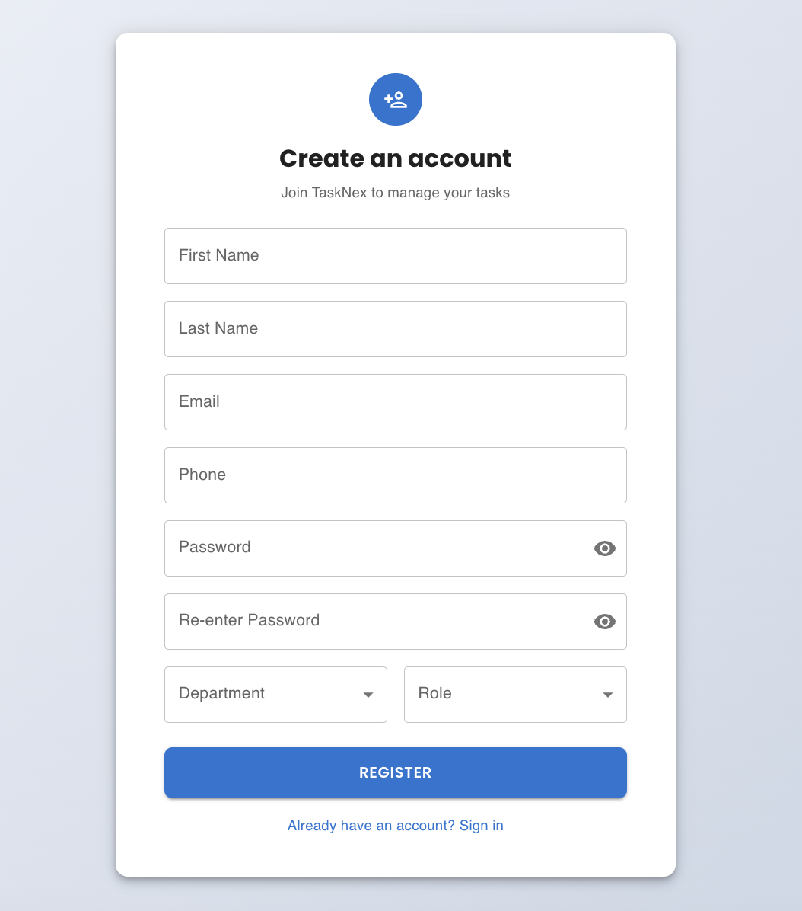
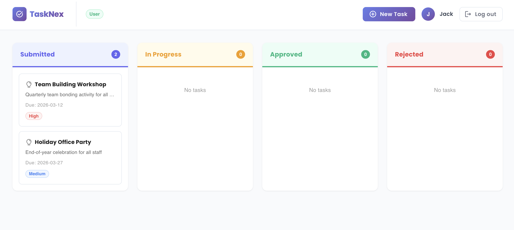
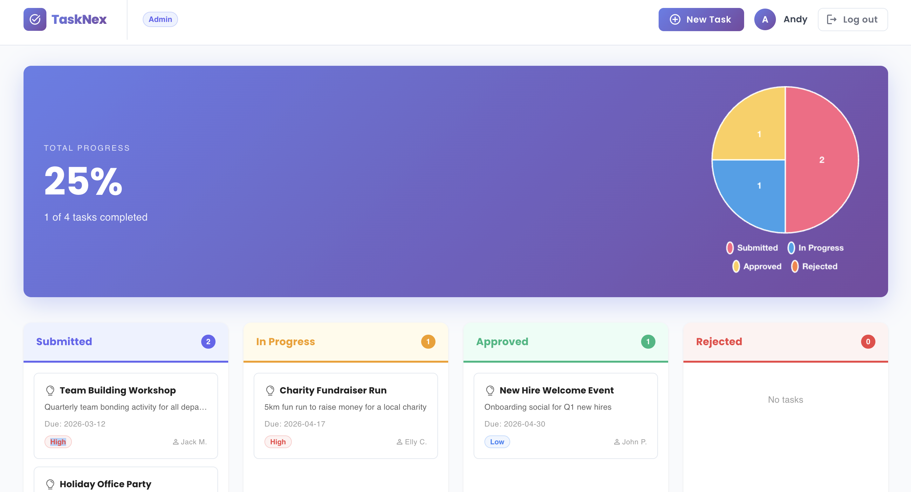
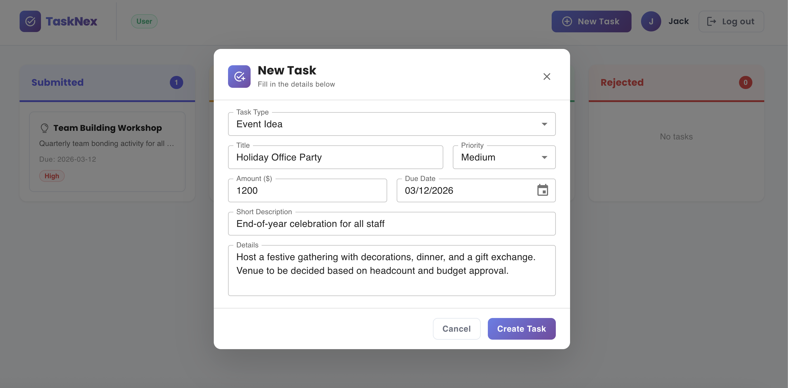
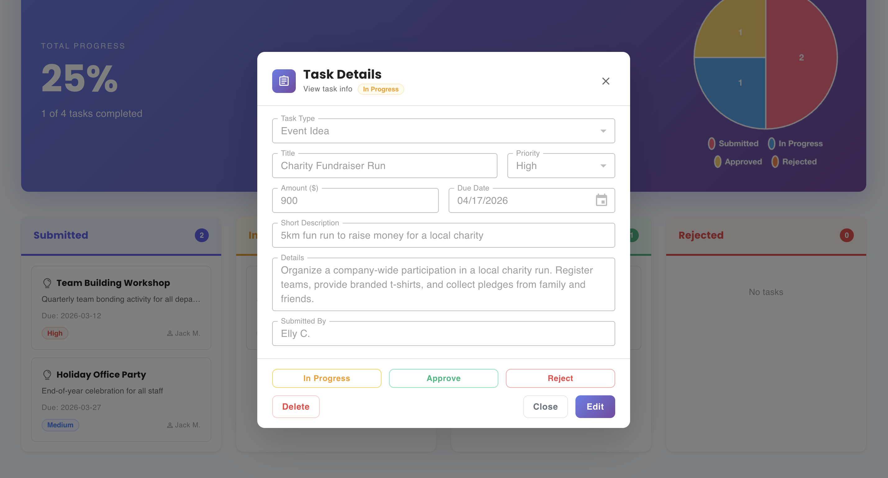

# TaskNex

A full-stack task management web application for teams — submit event ideas and expense claims, track approval status, and manage workflows by department.

**🚀 Live Demo:** https://task-nex.vercel.app

---

## Tech Stack

| Layer | Technology |
|-------|------------|
| Frontend | React 18, Material UI (MUI v5), Chart.js, MUI X DatePicker |
| Auth Server | Node.js, Express, JWT, bcryptjs, Mongoose |
| API Server | Node.js, Express, MongoDB Native Driver v6 |
| Database | MongoDB Atlas |
| Frontend Hosting | Vercel |
| Backend Hosting | Render |

---

## Features

### Authentication
Secure register and login with JWT tokens and bcrypt-encrypted passwords. Users select their department and role (Admin or User) on registration.

<p float="left">
  
  
</p>

- Email format validation
- Canadian phone number auto-formatting `(###)-###-####`
- Password visibility toggle + character-by-character peek effect
- Password match confirmation

---

### Kanban Dashboard
Tasks organized into 4 color-coded columns: **Submitted / In Progress / Approved / Rejected**



- Each card shows title, priority, due date, and task type
- Click any card to open the task detail popup
- Users only see their own submitted tasks

---

### Admin View
Admins see all tasks filtered by department type, a stats banner with completion percentage, and a pie chart showing task status distribution.



| Department | Sees |
|------------|------|
| HR Admin | All **Event Idea** tasks |
| Account Admin | All **Expense Claim** tasks |
| Other Admin | All tasks |

- Submitter name displayed on each card (`First L.` format)
- Approve / Reject / In Progress controls per task

---

### Create Task
Submit a new Event Idea or Expense Claim with title, priority, due date, amount, and description.



---

### Task Detail & Edit
Click any task card to view full details. Admins can change status; any user can edit or delete their own tasks.



---

## Project Structure

```
TaskNex/
├── react-front-end/               # React frontend → Vercel
│   └── src/
│       ├── components/
│       │   ├── Dashboard.jsx      # Kanban board with status columns
│       │   ├── Header.jsx         # App header with role badge & logout
│       │   ├── TaskCards.jsx      # Individual task card component
│       │   ├── TaskModule.jsx     # Task detail & edit popup
│       │   └── NewTaskModule.jsx  # Create new task popup
│       ├── helper/
│       │   └── pieChart.jsx       # Chart.js pie chart (admin only)
│       ├── login.jsx
│       └── register.jsx
│
└── Backend/
    ├── AuthServerPlusSchema/      # Auth server → Render (port 5050)
    │   ├── auth/
    │   │   ├── authController.js  # /register, /login, /userinfo
    │   │   └── userModal.js       # Mongoose User schema
    │   ├── app.js
    │   ├── db.js
    │   └── config.js
    │
    └── TaskNex_Server/            # Main API server → Render (port 8888)
        └── tasknexServer.js       # All task CRUD & status endpoints
```

---

## Local Development

### Prerequisites
- Node.js 18+
- MongoDB Atlas cluster (or local MongoDB)

### 1. Clone the repo
```bash
git clone https://github.com/yeji2060/TaskNex.git
cd TaskNex
```

### 2. Auth Server — terminal 1
```bash
cd Backend/AuthServerPlusSchema
npm install
```
Create `Backend/AuthServerPlusSchema/.env`:
```
PORT=5050
MONGO_URI=mongodb+srv://<user>:<password>@cluster.mongodb.net/tasknexdb
JWT_SECRET=your_secret_key
```
```bash
npm start
```

### 3. Main API Server — terminal 2
```bash
cd Backend/TaskNex_Server
npm install
```
Create `Backend/TaskNex_Server/.env`:
```
PORT=8888
MongoOnline=mongodb+srv://<user>:<password>@cluster.mongodb.net/
```
```bash
npm start
```

### 4. Frontend — terminal 3
```bash
cd react-front-end
npm install
```
Create `react-front-end/.env`:
```
REACT_APP_API_BASE_URL=http://localhost:8888
REACT_APP_AUTH_BASE_URL=http://localhost:5050
```
```bash
npm start
# → http://localhost:3000
```

---

## Deployment

### Backend (Render.com)

| Setting | Auth Server | Main API Server |
|---------|-------------|-----------------|
| Root Directory | `Backend/AuthServerPlusSchema` | `Backend/TaskNex_Server` |
| Build Command | `npm install` | `npm install` |
| Start Command | `npm start` | `npm start` |

**Environment Variables:**

Auth Server: `MONGO_URI`, `JWT_SECRET`

Main API Server: `MongoOnline`, `NODE_VERSION=18`

> **Important:** MongoDB Atlas → **Network Access** must allow `0.0.0.0/0` for Render's dynamic IPs.

### Frontend (Vercel)

| Setting | Value |
|---------|-------|
| Root Directory | `react-front-end` |
| Framework | Create React App |
| `REACT_APP_API_BASE_URL` | `https://<main-api>.onrender.com` |
| `REACT_APP_AUTH_BASE_URL` | `https://<auth-server>.onrender.com` |

---

## API Reference

### Auth Server (`/api/auth`)

| Method | Endpoint | Description |
|--------|----------|-------------|
| POST | `/register` | Register a new user |
| POST | `/login` | Login → returns JWT token |
| GET | `/userinfo` | Get current user profile |

### Main API Server

| Method | Endpoint | Description |
|--------|----------|-------------|
| GET | `/tasks` | Get all tasks |
| POST | `/insertEvent` | Create an Event Idea |
| POST | `/expenseClaim` | Create an Expense Claim |
| PUT | `/updateTaskStatus/:id` | Update task status |
| PUT | `/editTask/:id` | Edit task fields |
| DELETE | `/delEvent/:id` | Delete a task |

---

## Future Enhancements

- Real-time notifications for task status changes
- Advanced filters and search by keyword, date, or priority
- File/image attachments for expense claims
- Integration with Slack or Microsoft Teams

---

## Authors

EA, Yeji, and Victor
